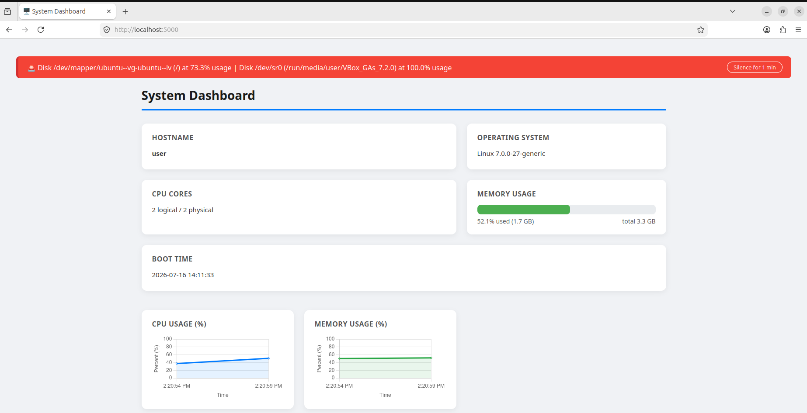
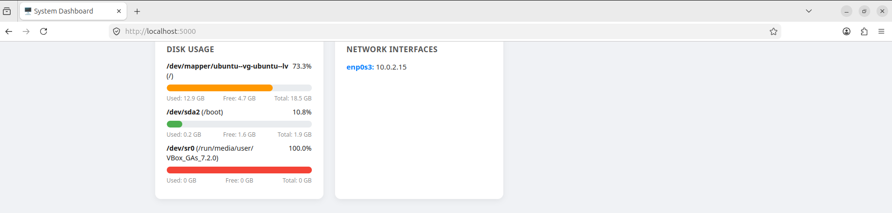
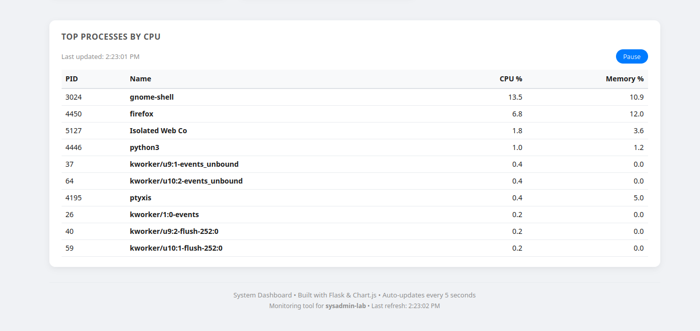

# sysadmin-lab


A hands‑on practice repository for system administration fundamentals, focusing on Linux and Windows internals, process management, resource monitoring, and OS‑level debugging. This lab accompanies my self‑study in preparation for security and operations roles.

## Table of Contents
- [Purpose](#purpose)
- [Repository Structure](#repository-structure)
- [Getting Started](#getting-started)
- [Tools & Environments](#tools--environments)
- [Scripts](#scripts)
- [Python Tools](#python-tools)
- [System Dashboard](#system-dashboard)
- [Testing the Tools](#testing-the-tools)
- [Documentation](#documentation)
- [Week 1 Summary](#week-1-summary)
- [Week 2 Summary](#week-2-summary)
- [Week 3 Summary](#week-3-summary)
- [Acknowledgements](#acknowledgements)

## Purpose
- Explore core OS concepts: processes, filesystems, permissions, system calls.
- Practice with essential tools: `htop`, `strace`, `lsof`, `ps`, `kill`, and the Sysinternals Suite.
- Document daily progress, commands, and observations in the [learning log](docs/LEARNING_LOG.md).

## Repository Structure
- `src/` – Python scripts and small utilities used during experiments.
- `docs/` – Learning log and screenshots from lab exercises.
- `tests/` – (future) Unit tests for any tools developed.
- `requirements.txt` – Python dependencies (currently only `psutil`).

## Getting Started
1. Clone the repo:
```bash
git clone https://github.com/bcyberly/sysadmin-lab.git
cd sysadmin-lab
```

2. (Optional) Create a virtual environment and install dependencies:
```bash
python -m venv venv
source venv/bin/activate   # or venv\Scripts\activate on Windows
pip install -r requirements.txt
```

3. Explore the Linux VM as described in the learning log.

## Tools & Environments
- **Linux VM**: Ubuntu 22.04 LTS (VirtualBox) for process tracing and filesystem exploration.
- **Sysinternals Suite**: Process Explorer, Process Monitor, and other advanced Windows tools.

---
## Scripts

Located in `src/scripts/`:

| Script | Purpose | Example Usage |
|--------|---------|---------------|
| `ps_process_report.ps1` | Exports all running processes to CSV and prints the top 5 by CPU and memory usage. | `.\src\scripts\ps_process_report.ps1 -Path "report.csv"` |
| `ps_startup.ps1` | Queries both HKLM and HKCU Run keys for startup programs, exports to CSV, and displays them. | `.\src\scripts\ps_startup.ps1 -Path "startup.csv"` |
| `inotify_logger.sh` | Monitors a directory (default `/tmp/test_monitor`) for file events (create, modify, delete, move) and logs them with timestamps. | `sudo ./src/scripts/inotify_logger.sh /path/to/watch` |

**Dependencies:**
- PowerShell scripts require **PowerShell** (built into Windows).  
- `inotify_logger.sh` requires **inotify-tools** (install via `sudo apt install inotify-tools -y` on Linux).  

**Usage examples:**

- **PowerShell:**
```powershell
.\src\scripts\ps_process_report.ps1 -Path "my_report.csv"
.\src\scripts\ps_startup.ps1 -Path "startup.csv"
```

- **Bash (Linux):**
```bash
sudo ./src/scripts/inotify_logger.sh /tmp/watch_dir
```

---
## Python Tools

Located in `src/` (Python scripts that can be run directly or imported as modules):

| Script | Purpose | Example Usage |
|--------|---------|---------------|
| `system_inventory.py` | Gathers point-in-time system info or runs continuous time-series telemetry (OS, CPU, memory, disk, network). Includes CLI routing (`--json`, `--csv`, `--output`, `--repeat`, `--delay`). | `python3 src/system_inventory.py --repeat 60 --delay 1 --csv --output trend.csv` |
| `trend_report.py` | Ingests telemetry CSVs and compiles a standalone, executive HTML dashboard with Base64-encoded `matplotlib` trend charts and summary statistics. | `python3 src/trend_report.py --input trend.csv --output report.html` |
| `dashboard/app.py` | Modernised Flask web interface exposing live OS metrics via REST API. Features a responsive grid UI, Chart.js rolling line charts, storage progress bars, IPv4 network mappings, top 10 CPU process table, and a proactive threshold alert engine with a session-based silence toggle. | `python3 app.py` then open `http://127.0.0.1:5000` |

**Dependencies:**
- `psutil` – Install via `pip install psutil`.
- `matplotlib` – Used for headless graph generation in `trend_report.py`.
  - *Note for modern Linux users (PEP 668 compliance):* Install via OS package manager instead of pip to protect global environments: `sudo apt install python3-matplotlib -y`
- `Flask` – Used for the telemetry web dashboard (install via `pip install flask`).

---
## System Dashboard

A Flask‑based web dashboard that displays real‑time system metrics and observability data.

### Features
- **Live system stats:** Hostname, OS, CPU cores, memory utilisation, disk partitions, and active IPv4 network interfaces.
- **Interactive charts:** Real‑time CPU and memory usage tracking over time (rolling 20‑point history window) using Chart.js.
- **Top processes:** Live‑updating table of the top 10 CPU‑hungry processes with a UX pause/resume toggle for incident investigation.
- **Threshold alerts:** Proactive visual warnings when CPU > 80%, disk > 85%, or memory > 90%.
- **Silence alerts:** Session‑based capability to temporarily mute notifications for 1 minute during active troubleshooting.
- **Auto‑refresh:** Asynchronous DOM updates via Fetch API every 5 seconds.

### Installation
```bash
# Install required Python dependencies
pip install -r requirements.txt
```

### Usage
```bash
# Start the Flask development server
python3 src/dashboard/app.py
```

Visit `http://localhost:5000` in your web browser.

### Dashboard Screenshot




### API Endpoints
| Endpoint | Description |
|----------|-------------|
| `GET /` | Renders the main HTML dashboard interface. |
| `GET /api/stats` | JSON endpoint serving hardware, network, disk metrics, and active threshold alerts. |
| `GET /api/processes` | JSON endpoint serving the top 10 running processes sorted by CPU utilisation. |

---
## Testing the Tools

Each module includes a self-test or can be run directly to verify functionality. Run these commands from the project root (`sysadmin-lab/`).

### System Inventory Tool
```bash
# Basic human-readable output
python3 src/system_inventory.py

# JSON output
python3 src/system_inventory.py --json

# CSV output with repeat mode
python3 src/system_inventory.py --repeat 5 --delay 2 --csv --output trend.csv
```

### Trend Report Generator
```bash
python3 src/trend_report.py --input trend.csv --output report.html
```

### System Dashboard
```bash
# Start the Flask server
python3 src/dashboard/app.py
# Then open http://localhost:5000 in your browser
```

---
## Documentation
See [docs/LEARNING_LOG.md](docs/LEARNING_LOG.md) for the detailed engineering journal, including `strace` labs, PowerShell scripting, filesystem monitoring, auditd, and the Flask dashboard development.

The log tracks daily progress, concepts, artifacts, and reflections – from environment setup to a complete system monitoring suite.

---
## Week 1 Summary

In Week 1, I established my OS internals lab environment and explored fundamental Linux administration tools. I set up an Ubuntu VM, enabled SSH, and installed essential monitoring tools (`strace`, `lsof`, `sysstat`, `htop`). I also prepared the Windows side with the Sysinternals Suite.

The week focused on using `strace` to trace system calls, which revealed the complexity hidden behind simple commands like `ls`. I discovered that even trivial commands make hundreds of system calls, demonstrating how user-space programs interact with the kernel. I then explored `inotify` for filesystem event monitoring, built a basic logger, and extended it to trigger actions on file creation. I also got hands-on with `auditd` for security logging and `vmstat`/`iostat` for performance monitoring. This foundation gave me a solid mental model of how Linux systems operate at the kernel level, preparing me for deeper system administration and security work.

---
## Week 2 Summary

In Week 2, I began building my system monitoring suite. I created the `system_inventory.py` script, starting with basic OS, CPU, and memory information, then expanded it with disk stats, network interfaces, and top processes. I added CLI routing (`--json`, `--csv`, `--repeat`, `--delay`) to make it suitable for data pipelines and SIEM integration, transforming a simple inventory tool into a continuous monitoring agent.

I also explored PowerShell scripting on Windows, creating scripts for process reporting and startup program analysis. I then built a trend analysis tool (`trend_report.py`) to visualise telemetry data using `matplotlib`, embedding charts directly into standalone HTML reports. This week established the core monitoring components that would later become the foundation of the Flask dashboard.

---
## Week 3 Summary

In Week 3, I built the full Flask web dashboard (`dashboard/app.py`) with real-time charts (Chart.js), threshold alerts, and a responsive UI – turning the CLI tool into a complete observability platform. I added live system stats, interactive CPU and memory charts, a top processes table, disk usage progress bars, network interface listings, and proactive threshold alerts with a silence toggle.

I also deepened my understanding of Python web development (Flask, REST APIs, Fetch API) and frontend visualisation (Chart.js). Throughout the week, I progressed through the OverTheWire Bandit CTF series (levels 0–12), documenting each write-up to reinforce Linux fundamentals and security concepts. This week transformed isolated scripts into a cohesive, production-ready monitoring platform.

---
## Acknowledgements
Built while studying *The Practice of System and Network Administration* (Limoncelli), *UNIX and Linux System Administration Handbook* (Nemeth), *PowerShell in a Month of Lunches* (Jones), and *Practical Packet Analysis* (Sanders).